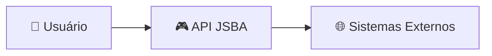
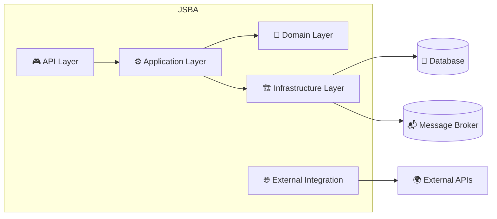
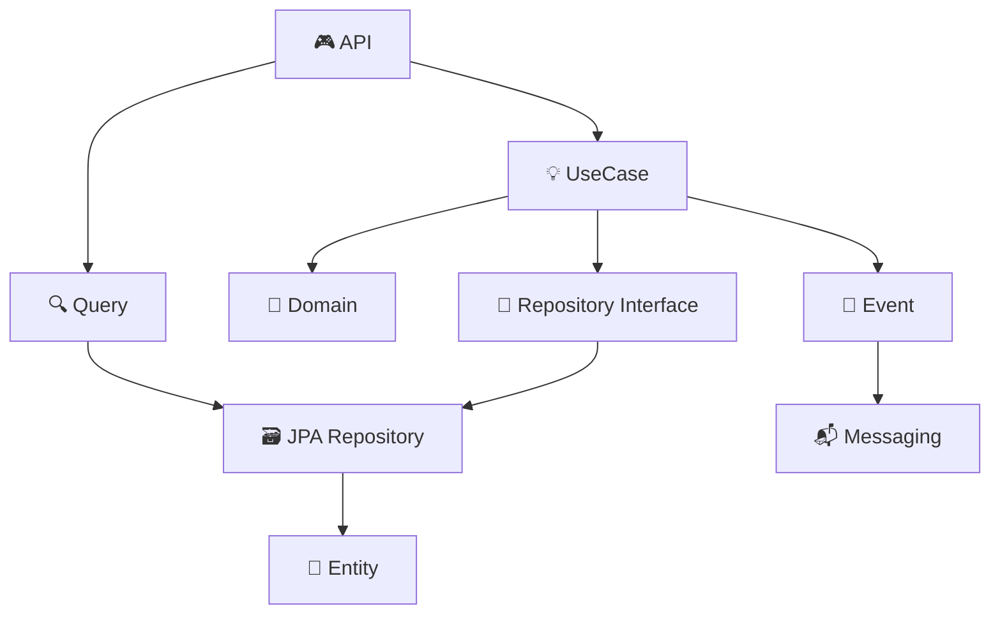
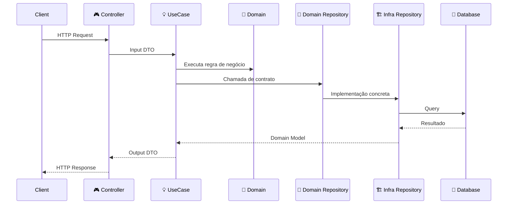
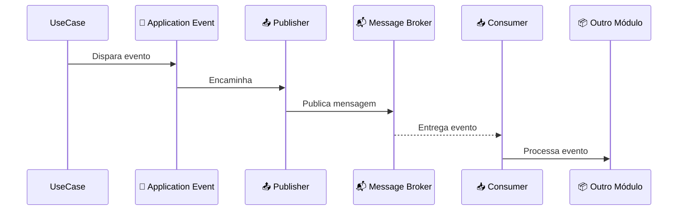
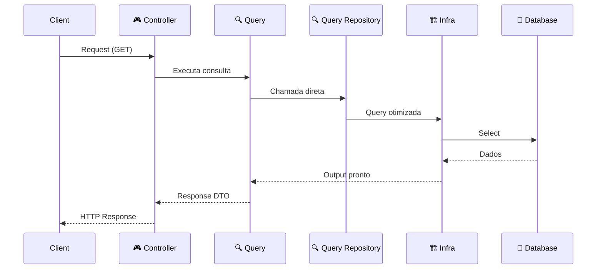
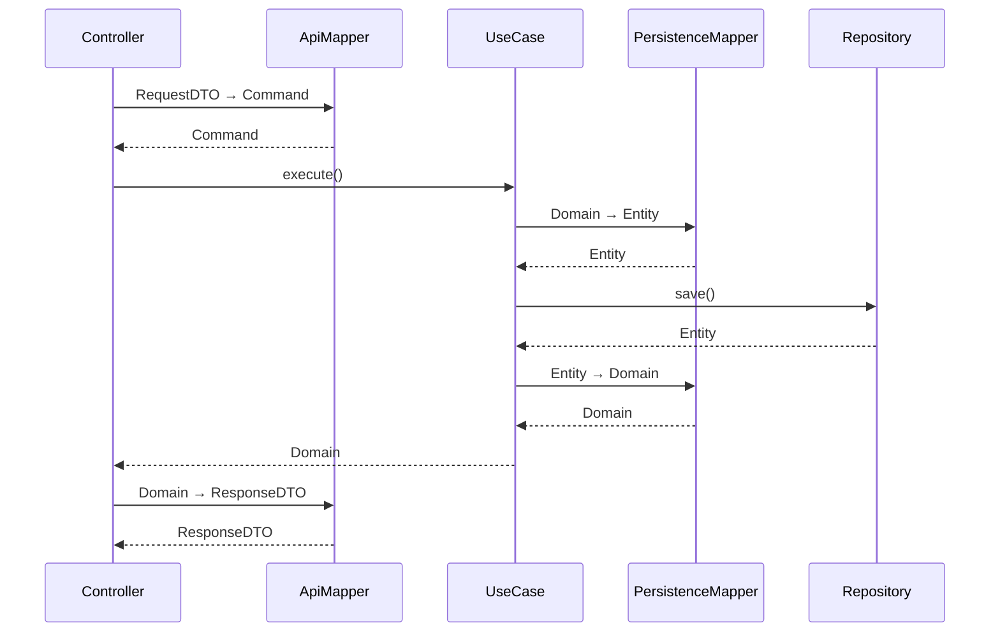

# JSBA - Java Spring Boot Application Project

### Versão 1.0.2-SNAPSHOT


<p align="left">
  
  
  
</p>

---

## ⚡ Quick Start

```bash
git clone https://github.com/JandeAJR/jsba-archetype.git
cd jsba-archetype

mvn clean install
mvn spring-boot:run
```

---

## 🐳 **Docker**

Execução local:

`docker compose --profile local up --build`

Deploy:

`docker compose --profile deploy up -d --build`

---

## Acesse a documentação da API:

* 👉 **Swagger UI:** [Open API](http://localhost:8081/api/jsba/swagger-ui/index.html)

---

## 💡 **Por que usar o arquétipo JSBA?**

- 🧠 Clean Architecture + DDD prontos para produção
- 🔐 Segurança desacoplada (JWT ou OAuth2/Keycloak)
- 📦 Modularização por contexto de negócio
- 📬 Suporte nativo a mensageria
- ⚡ Alta produtividade com padrões já definidos
- 🧩 Baixo acoplamento e alta coesão

---

## 🧩 **Principais Features**

- 📄 Paginação nativa com Spring (Pageable)
- 🔗 HATEOAS estruturado
- 🔍 Query dinâmica com Specification
- 🧭 Mapeamento com MapStruct
- 🔐 Integração com Spring Security + OAuth2
- 📦 Suporte a múltiplos bancos (H2, Oracle, etc)
- 🛫 Migrations com Flyway

---

## 📦 **Separação por camadas e suas responsabilidades**

- **api** → entrada
- **application** → orquestração
- **domain** → regra pura
- **infrastructure** → detalhe técnico

---

## 📖 **Sobre o Projeto**

<p align="left">
O **JSBA** é um acelerador de projetos (arquétipo/template) focado em aplicações corporativas de alta escalabilidade. Este projeto consolida as melhores práticas do ecossistema Java, seguindo os princípios de **Clean Architecture**, **DDD (Domain-Driven Design)**, **RESTful APIs** e **HATEOAS**. O **JSBA** pode ser integrado a diferentes camadas de segurança para autenticação e autorização. Essas integrações podem ocorrer tanto por meio de soluções internas implementadas na própria aplicação, utilizando tokens JWT, quanto por meio de provedores externos compatíveis com o protocolo OAuth2 e soluções de IDM/IAM. Entre os provedores suportados, destacam-se: Keycloak, Okta/Auth0, Microsoft Entra ID, Amazon Cognito, entre outros.
</p>

<p align="left">
O arquétipo/template **JSBA** foi baseado no framework Spring, e seus módulos Spring Boot, Spring Data e Spring Security; usando bibliotecas consagradas no uso em aplicações corporativas, como o Lombok, MapStruct e Spring Cloud OpenFeign. Foi concebido seguindo rigorosamente as boas práticas de arquitetura RESTful, incorporando princípios sólidos de modelagem de domínio e organização modular. Sua estrutura foi elaborada com foco em promover alta clareza na definição de responsabilidades, previsibilidade no comportamento dos serviços expostos e escalabilidade na evolução das funcionalidades. Além disso, o template busca estabelecer padrões consistentes que facilitem a manutenção, aprimorem a qualidade do código e garantam maior eficiência no desenvolvimento de soluções corporativas.
</p>

---

## 🔁 Changelog

**Versão 1.0.2-SNAPSHOT**  
Versão base com Java 17.  

**Versão 1.0.4-SNAPSHOT**  
Versão base atualizada para o Java 21. 

---

## 🚀 Tecnologias

### Core Framework
* **Java 21 / Spring Boot 4.0.2**
* **Spring Cloud OpenFeign:** Comunicação declarativa entre microserviços.
* **MapStruct:** Mapeamento de objetos (DTO <-> Entity) com alta performance.
* **Lombok:** Redução de código boilerplate.

### Persistência e Dados
* **Oracle Database (OJDBC11):** Banco de dados principal.
* **H2 Database:** Utilizado para ambiente de desenvolvimento e testes rápidos.
* **Flyway:** Versionamento e migração de schema de banco de dados.
* **Spring Data JPA:** Abstração de persistência.

### Segurança e Autenticação
* **Spring Security:** Proteção robusta de endpoints.
* **JSON Web Token (JWT - JJWT):** Autenticação Stateless.
* **Spring Security OAuth2 Resource Server:** Autenticação OAuth2.
* **Apache Commons Codec:** Encoders e decoders para diversos formatos.

---

## 🛠️ Stack Tecnológica & Dependências

Abaixo estão listadas as bibliotecas e ferramentas que compõem o ecossistema do projeto, organizadas por responsabilidade:

### ⚙️ Core & Utilitários
* `spring-boot-devtools` — Hot reloading e produtividade.
* `spring-boot-configuration-processor` — Processamento de metadados de configuração.
* `org.projectlombok` — Redução de código boilerplate com Lombok.
* `lombok-mapstruct-binding` — **v0.2.0** | Integração entre Lombok e MapStruct.
* `mapstruct` — **v1.5.5.Final** | Mapeamento de objetos de alta performance.
* `mapstruct-processor` — **v1.5.5.Final** | Gerador de código para mappers.

### 🌐 Web & APIs
* `spring-boot-starter-web` — Base para APIs RESTful.
* `spring-boot-starter-hateoas` — Implementação de Hipermídia (Nível 3 REST).
* `springdoc-openapi-starter-webmvc-ui` — **v3.0.0** | Interface Swagger para documentação.

### 🗄️ Persistência & Banco de Dados
* `spring-boot-starter-data-jpa` — Abstração de persistência Java.
* `spring-boot-h2console` / `h2` — Banco de dados em memória para dev/testes.
* `ojdbc11` — Driver de conexão nativo Oracle.
* `flyway-core` / `flyway-database-oracle` — Gestão de versionamento do Schema SQL.

### 🔐 Segurança
* `spring-boot-starter-security` — Framework de proteção de endpoints.
* `spring-boot-starter-oauth2-resource-server` — **v3.3.0** | Starter para Spring Security OAuth2 Resource Server.
* `spring-security-crypto` — Utilitários para criptografia de passwords.
* `jjwt-api` / `impl` / `jackson` — **v0.13.0** | Implementação robusta de tokens JWT.
* `commons-codec` — O componente Apache Commons Codec contém encoders e decoders para formatos Base16, Base32, Base64, digest, e Hexadecimal.

### 🔌 Integrações & Testes
* `spring-cloud-starter-openfeign` — **v5.0.0** | Cliente HTTP declarativo.
* `spring-boot-starter-test` — Framework base para testes unitários e integração.
* `spring-security-test` — Suporte para testes em rotas protegidas.

### 🔧 Plugins Maven
Abaixo estão os plugins essenciais configurados no `pom.xml`:

> Estes plugins são cruciais para o ciclo de build e geração automática de código.

1. **`spring-boot-maven-plugin`**: Permite a execução da aplicação via CLI e gera o JAR executável.
2. **`maven-compiler-plugin`**: Gerencia a compilação Java e a integração das annotations do Lombok e do MapStruct.

---

## 🏗️ Estrutura Arquitetural (DDD Pattern)

O projeto adota uma estrutura modular baseada nos princípios de **Domain-Driven Design (DDD)** e **Clean Architecture**, garantindo o desacoplamento entre a infraestrutura e as regras de negócio.

---

## 📂 Arquitetura do Projeto JSBA

A estrutura do projeto segue os princípios de **Clean Architecture** e **DDD (Domain-Driven Design)**, organizada em camadas bem definidas e orientadas a responsabilidade.

Cada diretório representa um papel claro dentro do sistema, promovendo **baixo acoplamento**, **alta coesão** e **evolução sustentável**.

---

### 🚀 `application/` — Núcleo transversal da aplicação

Responsável por configurações globais, integrações externas e organização dos módulos de negócio.

* 🚀 `bootstrap/` → Inicialização e análise de falhas da aplicação
* ⚙️ `config/` → Configurações e beans do Spring
* 🌐 `external/` → Integrações externas (HTTP, mensageria e serviços)

  * 📡 `http/feign` → Clientes HTTP
  * 📬 `messaging/` → Publicadores globais de eventos
* 📦 `modules/` → Módulos de negócio (Bounded Contexts)
* ⚙️ `shared/` → Componentes reutilizáveis (utils, exceptions, wrappers)

---

### 📦 Módulos de Negócio (Arquitetura Interna)

Cada módulo segue uma arquitetura isolada e consistente:

* 🎮 `api/` → Camada de entrada (REST, DTOs, consumers)
* ⚙️ `application/` → Orquestração dos casos de uso

  * 💡 `usecase/` → Casos de uso
  * 🔍 `query/` → Consultas e relatórios
  * 🔔 `event/` → Eventos internos
* 🧠 `domain/` → Regras de negócio e contratos (núcleo puro)
* 🏗️ `infrastructure/` → Implementações técnicas (JPA, mensageria, etc)

> 📌 O domínio não depende de frameworks nem de outras camadas.

---

### 📬 Mensageria

A comunicação assíncrona é organizada de forma explícita:

* 📤 **Publisher global** → `application.external.messaging`
* 📤 **Publisher do módulo** → `infrastructure.messaging`
* 📥 **Consumer** → `api.messaging`

> 📌 Separação clara entre quem publica e quem consome eventos.

---

### ⚙️ `shared/` — Componentes Compartilhados

Contém recursos reutilizáveis entre todos os módulos:

* 🧩 `assembler/` → Conversões globais
* ⚠️ `exception/` → Tratamento de erros (global e negócio)
* 🛠️ `util/` → Utilitários
* 📦 `wrapper/` → Padronização de respostas

---

### 🛡️ `security/` — Arquitetura de Segurança Modular

Organizada por provedores de autenticação:

* 🛠️ `common/` → Componentes compartilhados de segurança (DSL, services)
* 🔑 `jwt/` → Implementação baseada em JWT
* 🔐 `oauth2.keycloak/` → Integração com Keycloak

Cada provedor possui seu próprio núcleo (`core/`) seguindo Clean Architecture:

* 🎮 API
* ⚙️ Application
* 🧠 Domain
* 🏗️ Infrastructure

---

## 🧭 Princípios da Arquitetura

* Separação clara de responsabilidades
* Domínio isolado de frameworks
* Arquitetura modular por contexto de negócio
* Suporte a comunicação síncrona e assíncrona
* Reutilização controlada via `shared`
* Segurança desacoplada e extensível

---

## ✨ Filosofia

> O código não é apenas executável — ele é **legível como arquitetura**.
> Cada pacote conta uma história. Cada símbolo revela uma intenção.

---

## 🏗️ Os módulos básicos que já vêm prontos para uso na aplicação **JSBA** são:

### 🛠️ Arquitetura de Módulos

> ### 🧩 `appinfo`
> Módulo de informações acerca dos **metadados** da aplicação, como: nome da aplicação, versão, profile ativo, entre outros.

> ### 🏢 `example`
> Módulo de exemplo, para servir de modelo para um módulo de aplicação, contendo a estrutura padrão completa que um módulo pode ter, e seguindo os padrões Clean Architecture e Domain-Driven Design (DDD).

> ### 🔐 `security.jwt`
> Módulo para **autenticação e autorização** de usuários realizadas pela própria aplicação, com persistência dos dados em banco de dados local.

> ### 🌐 `security.oauth2.keycloak`
> Módulo para autenticação e autorização realizado pelo **Keycloak**.

<br />
  
> ⚠️
> **Dica de Implementação:** Escolha entre `security.jwt` ou `security.oauth2.keycloak` dependendo da necessidade de Single Sign-On (SSO) do seu projeto.

---

### 📂 Estrutura de Pacotes do Projeto
```text
src/main/java/br.net.community.jsba
│
├── 🚀 application/                             # Core Transversal da Aplicação
│   │
│   ├── 🚀 bootstrap/                           # Classes para inicialização e testes
│   │   └── 🚀 failure/                         # Analyzer das exceções de inicialização
│   │
│   ├── ⚙️ config/                              # Beans e Configurações Spring
│   │   └── ⚙️ properties/                      # Classes para biding das configurações
│   │
│   ├── 🌐 external/                            # Configurações de recursos externos
│   │       ├── 📡 http/                        # Clientes http
│   │       │   └── 📡 feign/                   # Clientes http Open Feign
│   │       ├── 📬 messaging/                   # Publicadores em filas/eventos globais (Publisher)
│   │       └── 🛠️ service/                     # Serviços externos da aplicação
│   │
│   ├── 📦 modules/                             # Domínios de Negócio (Bounded Contexts)
│   │   │
│   │   ├── ℹ️ appinfo.api/                     # Módulo de metadados/informação da app
│   │   │
│   │   └── 🏢 example/                         # Exemplo de Módulo de Negócio Padrão
│   │       ├── 🎮 api/                         # Camada de Entrada (Adapters In)
│   │       │   ├── 📨 dto/                     # Data Transfer Objects (Request/Response)
│   │       │   │   ├── 🛠️ request/             # Dto Request
│   │       │   │   └── 🛠️ response/            # Dto Response
│   │       │   ├── 🔄 mapper/                  # MapStruct/Conversão nível API
│   │       │   ├── 📟 messaging/               # Consumidores de filas/eventos (Consumer)
│   │       │   └── 🛣️ rest/                    # Controllers e Assemblers HATEOAS
│   │       ├── ⚙️ application/                 # Orquestração (Use Cases)
│   │       │   ├── 🔔 event/                   # Eventos internos da aplicação (para mensageria)
│   │       │   ├── 🔄 mapper/                  # Mapeamento para DTOs de aplicação
│   │       │   ├── 🔍 query/                   # Implementação de consultas e relatórios
│   │       │   │   ├── 🔍 filter/              # Filtros especializados para consultas
│   │       │   │   ├── 🔍 output/              # Classes que respresental os dados de saída
│   │       │   │   ├── 🔍 repository/          # Interfaces repository para representar as queries
│   │       │   │   └── 🔍 spec/                # Queries especializadas
│   │       │   ├── 🛠️ service/                 # Serviços de aplicação
│   │       │   ├── 💡 usecase/                 # Lógica de caso de uso pura
│   │       │   │   ├── 💡 usecase1/            # Exemplo de um caso de uso e sua estrutura de pacotes
│   │       │   │   │   ├── 💡 input/           # Classes que respresental os dados de entrada
│   │       │   │   │   └── 💡 output/          # Classes que respresental os dados de saída
│   │       │   │   └── 💡 usecase2/             
│   │       │   │       ├── 💡 input/           
│   │       │   │       └── 💡 output/          
│   │       ├── 🧠 domain/                      # O Coração do Negócio (Portas/Modelos)
│   │       │   ├── 📄 model/                   # Objetos de Domínio (POJOs puros)
│   │       │   └── 📁 repository/              # Interfaces (Portas de Saída)
│   │       └── 🏗️ infrastructure/              # Detalhes Técnicos (Adapters Out)
│   │            ├── 💾 entity/                 # Entidades JPA/Hibernate
│   │            ├── 🔄 mapper/                 # Mappers Domínio ↔️ Entidade
│   │            ├── 📬 messaging/              # Publicadores em filas/eventos internos (Publisher)
│   │            ├── 🔍 projection/             # Consultas otimizadas (Read-Only)
│   │            ├── 🗃️ repository/             # Implementações (JPA Repositories)
│   │            │   └── 🛠️ impl/               # Implementação dos repositórios de dados
│   │            └── ⚙️ service/                # Serviços internos do módulo
│   │                └── 🛠️ impl/               # Implementação dos serviços
│   │
│   ├── ⚙️ shared/                              # Recursos compartilhados com toda a aplicação
│   │   ├── 🧩 assembler/                       # Conversão global de objetos
│   │   ├── ⚠️ exception/                       # Handler global de erros
│   │   │   ├── ⚠️ global/                      # Classes de exceptions globais
│   │   │   └── ⚠️ business/                    # Classes de exceptions de regras de negócio
│   │   ├── 🗃️ persistence/                     # Regras e especificações compartilhadas para persistência de dados
│   │   │   └── 🗃️ specification/               # Especificações compartilhadas para persistências de dados
│   │   │       └── 🗃️ jpa/                     # Especificações compartilhadas para JPA
│   │   ├── 🔍 query/                           # Recursos compartilhados para queries
│   │   │   └── 🔍 filter/                      # Filtros especializados para queries
│   │   ├── 🛠️ util/                            # Helpers (DateUtils, StringUtils, etc)
│   │   └── 📦 wrapper/                         # Padronização de Response Entities
│   │
│   └── 🏁 Application.java                     # Spring Boot Main Class
│
│
└── 🛡️ security/                                # Ecossistema de Segurança Modular
    │
    ├── 🛠️ common/                              # Componentes compartilhados de segurança
    │   ├── 🧠 domain/                          # Portas/Modelos do módulo
    │   │   └── 📄 model/                       # Objetos de Domínio (POJOs puros)    
    │   ├── 🧭 dsl/                             # Dsl específica para o módulo
    │   └── 🛠️ service/                         # Serviços internos do módulo
    │       └── 🛠️ impl/                        # Implementação dos serviços
    │
    ├── 🔑 jwt/                                 # Provedor JWT (Estrutura Completa)
    │   ├── ⚙️ config/                          # Beans e Configurações Spring
    │   │   └── ⚙️ properties/                  # Classes para biding das configurações
    │   ├── 🧭 filter/                          # Filtros internos do módulo    
    │   ├── 📦 core/                            # Núcleo do módulo de autenticação Jwt
    │   │   ├── 🎮 api/
    │   │   ├── ⚙️ application/
    │   │   ├── 🚀 bootstrap/             
    │   │   ├── 🧠 domain/
    │   │   └── 🏗️ infrastructure/     
    │   └── 🛠️ service/                         # Serviços internos do módulo Jwt
    │           
    │
    └── 🔐 oauth2.keycloak/                     # Provedor Keycloak (Estrutura Completa)
        ├── ⚙️ config/                          # Beans e Configurações Spring
        │   └── ⚙️ properties/                  # Classes para biding das configurações
        ├── 🔄 converter/                       # Mapeamento de Claims/Roles
        ├── 📡 infrastructure.http.feign/       # Integração com API Keycloak
        ├── 📦 core/                            # Núcleo do módulo de autenticação Keycloak
        │   ├── 🎮 api/   
        │   ├── 🚀 bootstrap/             
        │   └── 🏗️ infrastructure/
        └── 🛠️ service/                         # Serviços internos do módulo Keycloak


⚠️ Atenção! Os módulos básicos que já vem pronto para uso na aplicação JSBA são:

1. appinfo:                    Módulo de informações acerca dos metadados da aplicação: nome da aplicação, versão, profile, ...

2. security.jwt:               Módulo para autenticação e autorização de usuários realizadas pela própria aplicação,
                               e com persistência dos dados em banco de dados da própria aplicação.

3. security.oauth2.keycloak:   Módulo para autenticação e autorização de usuários realizadas por um IDM externo à aplicação.
                               No caso deste pacote, o processo de autorização e autenticação é feito pelo Keycloak.
```

---

## 🧭 Diagramas da Arquitetura JSBA

### 🧱 C4 — Nível 1 (Contexto)



---

### 🧩 C4 — Nível 2 (Containers)



---

### 🧠 C4 — Nível 3 (Módulo Interno)



---

## 🔁 Fluxo de Requisição (Request Lifecycle)



---

## 📬 Fluxo de Eventos (Event-Driven)



---

## 🔍 Fluxo de Query (Leitura otimizada)



---

## ✨ Leitura Rápida da Arquitetura

* 🎮 **API** → ponto de entrada
* 💡 **UseCase** → orquestra o fluxo
* 🧠 **Domain** → regras de negócio puras
* 🏗️ **Infrastructure** → implementação técnica
* 📬 **Messaging** → comunicação assíncrona
* 🔍 **Query** → leitura otimizada (fora do domínio)

---

## 🧭 Filosofia Visual

> A arquitetura do JSBA não precisa ser explicada.
> Ela é **lida, percebida e entendida**.

Cada fluxo responde:

* “quem entra?” → 🎮 API
* “quem decide?” → 💡 Aplicação (application)
* “quem sabe?” → 🧠 Domínio (domain)
* “quem executa?” → 🏗️ Infraestrutura (infrastructure)
* “quem comunica?” → 📬 Mensageria (messaging)

---

## 📘 Fluxo de Mapeamento entre as camadas (Mappers)

1. Controller (Resources) recebem RequestDTO  
2. ApiMapper converte DTO → Command  
3. UseCase executa lógica de regra de negócio  
4. PersistenceMapper converte Domain → Entity  
5. Repository persisti Entity  
6. PersistenceMapper converte Entity → Domain  
7. ApiMapper converte Domain → ResponseDTO  
8. Controller (Resources) retorna response  



---

## 📘 Guia Oficial de Mapeamento entre Camadas (Clean Architecture)

Este guia define **onde implementar cada Mapper** dentro da arquitetura, seguindo os princípios de **Clean Architecture**, **DDD** e **Ports & Adapters**.

A regra fundamental é:

> **Um Mapper só deve existir na camada que possui conhecimento legítimo sobre ambos os lados da conversão.**

Isso evita violações como:
- API conhecer Entities  
- Infraestrutura conhecer DTOs  
- Domínio conhecer abstrações externas  

## 🧭 1. Onde Criar Cada Tipo de Mapper

A seguir estão as regras de criação dos mappers, organizadas por tipo de conversão.

### ► Domain Model → API DTO
- O mapper deve ser criado **na camada API**.
- A API converte o modelo interno em um contrato exposto externamente.
- Nomeclatura para o método de mapeamento: **toDtoFromDomain** ou **toDtoFromDomainList**

### ► Application Output → API DTO
- O mapper deve ficar **na camada API**.
- A API adapta a saída de um caso de uso para um DTO de resposta HTTP.
- Nomeclatura para o método de mapeamento: **toDtoFromApplicationOutput** ou **toDtoFromApplicationOutputList**

### ► Application Input → Domain Model
- <u>*Permitido apenas em casos específicos*</u> onde a entrada de um caso de uso é composta pela entrada de outro caso de uso.
- O mapper deve ser criado **na camada Application**.
- A camada de aplicação transforma comandos/inputs em modelos de domínio.
- Nomeclatura para o método de mapeamento: **toDomainFromApplicationInput** ou **toDomainFromApplicationInputList**

### ► Application Output → Domain Model
- <u>*Permitido apenas em casos específicos*</u> onde a entrada de um caso de uso é composta pela saída de outro caso de uso.
- Exemplo: No caso de uso Cadastrar Usuário, as roles de usuário, que serão atribuídas ao novo usuário, vêm do caso de uso Listar Roles.
- O mapper deve ser criado **na camada Application**.
- A camada de aplicação transforma comandos/inputs em modelos de domínio.
- Nomeclatura para o método de mapeamento: **toDomainFromApplicationOutput** ou **toDomainFromApplicationOutputList**

### ► Infrastructure Entity → API DTO *(Exceção: Spring Security)*
- <u>*Permitido apenas em casos específicos*</u> dos módulos de segurança que utilizam a implementação do Spring Security Framework.
- Deve ficar **na camada Infraestrutura**, dentro do módulo de segurança.
- Justificativa: o Spring Security impõe modelos próprios como `UserDetails` e `GrantedAuthority`.
- Nomeclatura para o método de mapeamento: **toDtoFromEntity** ou **toDtoFromEntityList**

### ► Infrastructure Entity → Domain Model
- O mapper deve ficar **na camada Infraestrutura**.
- A infraestrutura converte entidades (detalhes técnicos) para modelos de domínio.
- Nomeclatura para o método de mapeamento: **toDomainFromEntity** ou **toDomainFromEntityList**

### ► Infrastructure Projection → Application Output
- O mapper deve ficar **na camada Infraestrutura**.
- Projections são detalhes de consulta e não devem vazar para Application.
- Nomeclatura para o método de mapeamento: **toApplicationOutputFromProjection** ou **toApplicationOutputFromProjectionList**

### ► Domain Model → Infrastructure Entity
- O mapper deve ficar **na camada Infraestrutura**.
- Usado para operações de escrita (persistência).
- Nomeclatura para o método de mapeamento: **toEntityFromDomain** ou **toEntityFromDomainList**

## 🏷️ 2. Convenção de Nomes das Interfaces Mapper

### ► Use sempre o padrão:

**Como nomear a interface mapper: {Nome da camada da aplicação}{Domínio}Mapper.class**

*Exemplos:*

> Camada API: **ApiUserMapper.class**  
> Camada APPLICATION: **ApplicationUserMapper.class**  
> Camada INFRASTRUCTURE: **InfrastructureUserMapper.class**  
> Camada INFRASTRUCTURE (Queries): **InfrastructureUserRolesQueryMapper.class**  
<br />

---

## 🚦 Como Começar

### Pré-requisitos
* ☕ **JDK 17** — Ambiente de execução e desenvolvimento Java.
* 🏗️ **Maven 3.8+** — Gestor de dependências e automação de build.
* 🐳 **Docker** *(Opcional)* — Para orquestração de instâncias de banco de dados e containers.

### Instalação e execução da aplicação
1. Clonar o repositório:
   git clone [https://github.com/JandeAJR/jsba-archetype.git](https://github.com/JandeAJR/jsba-archetype.git)

2. Test (opcional):
	mvn test

3. Build:
	mvn clean install
	
4. Run:
	mvn spring-boot:run -Dspring-boot.run.profiles=test	
	
```bash
# Clone 
git clone https://github.com/JandeAJR/jsba-archetype.git

# Test (opcional)
mvn test

# Build
mvn clean install

# Run
mvn spring-boot:run -Dspring-boot.run.profiles=test

# Criar um novo módulo para a aplicação (Ex. um módulo chamado cliente)
cd /scripts
groovy create-module.groovy cliente

# Rodar a aplicação através do Docker Compose (deploy)
docker compose --profile deploy up --build
docker compose --profile deploy up -d --build

# Rodar a aplicação localmente através do Docker Compose (local)
docker compose --profile local up --build
docker compose --profile local up -d --build
```

---

### 📖 Documentação da API (Swagger)
* ⚡ **Swagger UI:** [Open API](http://localhost:8081/api/jsba/swagger-ui/index.html)
* 🔗 **OpenAPI Spec:** [/v3/api-docs](http://localhost:8081/api/jsba/v3/api-docs)

<br />


## 🛡️ Endpoints do Módulo Base da Aplicação (Base Module)

O caminho base para todos os recursos é: `http://localhost:8080/api/jsba`


### 🖥️ Application
*  **Application Info**
  > `http://localhost:8081/api/jsba/application/info`
  > Retorna metadados e status da aplicação.
  

### 🔐 Auth - Autenticação interna (Jwt)
*  **Auth Login**
  > `http://localhost:8081/api/jsba/auth/login`
  > Autenticação de credenciais para geração de Token JWT.
  
*  **Auth Refresh**
  > `http://localhost:8081/api/jsba/auth/refresh`
  > Refresh token da aplicação.
  
*  **Auth Logout**
  > `http://localhost:8081/api/jsba/auth/logout`
  > Logout da aplicação.

*  **Auth Me**
  > `http://localhost:8081/api/jsba/auth/me`
  > Recupera informações do perfil do utilizador atualmente logado (Contexto Spring Security).


### 🎭 Roles
*  **Create Role**
  > `http://localhost:8081/api/jsba/roles`
  > Registo de novos perfis de acesso no sistema.

*  **List All Roles (Pageable)**
  > `http://localhost:8081/api/jsba/roles`
  > Listagem de perfis com suporte nativo a paginação.

*  **List All Roles**
  > `http://localhost:8081/api/jsba/roles/all`
  > Retorna todos os perfis cadastrados sem filtros.

*  **List Role By Id**
  > `http://localhost:8081/api/jsba/roles/{id}`
  > Procura detalhada de um perfil por identificador único.

*  **List Role By Name**
  > `http://localhost:8081/api/jsba/roles/name/{name}`
  > Procura de perfil filtrando pelo nome técnico.


### 👤 Usuários
*  **Create User**
  > `http://localhost:8081/api/jsba/users`
  > Criação de conta de utilizador vinculada a perfis (Roles).

*  **List All Users (Pageable)**
  > `http://localhost:8081/api/jsba/users`
  > Listagem paginada de utilizadores para gestão administrativa.

*  **List All Users**
  > `http://localhost:8081/api/jsba/users/all`
  > Retorna todos os utilizadores ativos.

*  **List User By Id**
  > `http://localhost:8081/api/jsba/users/{id}`
  > Detalhes técnicos de um utilizador específico.

*  **List User By Username**
  > `http://localhost:8081/api/jsba/users/username/{username}`
  > Procura rápida baseada no login do utilizador.
  
### 📄 Query (consultas JPQL e Native Query para relatórios de usuários)
*  **User Roles Query Report (JPQL Query)**
  > `http://localhost:8081/api/jsba/user-roles/query/user-roles-jpql-query?username={username}`
  > Relatório de usuários e suas respectivas roles, filtrado pelo nome de usuário (consulta gerada por JPQL Query).

*  **User Roles Query Report (Native Query)**
  > `http://localhost:8081/api/jsba/user-roles/query/user-roles-native-query?username={username}&exactly={true/false}`
  > Relatório de usuários e suas respectivas roles, filtrado pelo nome de usuário (consulta gerada por Native Query).
  
### 🔍 Query Spec (consultas JPA com critérios especializados)  

**🎭 Roles**    
*  **Roles By Name Query Spec**
  > `http://localhost:8081/api/jsba/roles/query/spec/bynames?names=ROLE_ADMIN,ROLE_BASIC_USER&operator=STARTS_WITH&page=0&size=20`
  > Listar roles pelo nome.

**👤 Usuários**
*  **Users By Name Query Spec**
  > `http://localhost:8081/api/jsba/users/query/spec/byname?name=ad&operator=STARTS_WITH&page=0&size=20`
  > Listar usuários pelo nome.
  
*  **Users By Usernames Query Spec**
  > `http://localhost:8081/api/jsba/users/query/spec/byusernames?usernames=admin,basic&operator=STARTS_WITH&page=0&size=20`
  > Listar usuários por usernames.

### 🔐 Auth - Autenticação externa (Keycloak)
*  **Auth Callback**
  > `http://localhost:8081/api/jsba/auth/callback`
  > Troca o code de acesso do usuário pelos tokens de acesso e de refresh no Keycloak (utiliza Cookie HttpOnly).
  
*  **Auth Refresh**
  > `http://localhost:8081/api/jsba/auth/refresh`
  > Refresh token da aplicação (utiliza Cookie HttpOnly).
  
*  **Auth Logout**
  > `http://localhost:8081/api/jsba/auth/logout`
  > Logout da aplicação (utiliza Cookie HttpOnly).

*  **Auth Me**
  > `http://localhost:8081/api/jsba/auth/me`
  > Recupera informações do perfil do utilizador atualmente logado (Contexto Spring Security).

### 🛡️ IDM/IAM (endpoints para testes usando a autenticação no Keycloak) 
*  **Test Keycloak: users**
  > `http://localhost:8081/api/jsba/test/keycloak/users`
  > Acesso para o enpoint /test/idm/users. A autenticação é feita no Keycloak.

*  **Test Keycloak: user admin**
  > `http://localhost:8081/api/jsba/test/keycloak/users/admin`
  > Acesso para o enpoint /test/idm/users/admin. A autenticação é feita no Keycloak.

*  **Test Keycloak: user basic**
  > `http://localhost:8081/api/jsba/test/keycloak/users/basic`
  > Acesso para o enpoint /test/idm/users/basic. A autenticação é feita no Keycloak.

*  **Test Keycloak: user anonymous**
  > `http://localhost:8081/api/jsba/test/keycloak/users/anonymous`
  > Acesso para o enpoint /test/idm/users/anonymous. A autenticação é feita no Keycloak.
  
---

## 🤝 Contribuições

Contribuições são muito bem-vindas!

- Fork o projeto
- Crie uma branch (feature/minha-feature)
- Commit suas alterações
- Abra um Pull Request

---

## 📄 Licença

Este projeto está sob a licença MIT.

---

## 💬 Suporte

Se este projeto te ajudou, considere dar uma estrela ⭐ no repositório.

---

## 🧭 Roadmap (futuro)

- Integração com mensageria (Kafka/RabbitMQ)
- Template para microsserviços
- Observabilidade (Tracing + Metrics)
- Deploy automatizado (CI/CD)
- Evoluir para um projeto Open Source
